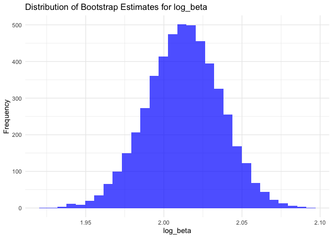

p8105_hw6_zf2352
================
Zhenkun Fang
2024-12-02

# Problem 1

``` r
weather_df = 
  rnoaa::meteo_pull_monitors(
    c("USW00094728"),
    var = c("PRCP", "TMIN", "TMAX"), 
    date_min = "2017-01-01",
    date_max = "2017-12-31") %>%
  mutate(
    name = recode(id, USW00094728 = "CentralPark_NY"),
    tmin = tmin / 10,
    tmax = tmax / 10) %>%
  select(name, id, everything())
```

``` r
boot_sample = function(df) {
  sample_frac(df, replace = TRUE)
}


boot_straps = 
  tibble(strap_number = 1:5000) |> 
  mutate(
    strap_sample = map(strap_number, \(i) boot_sample(df = weather_df))
  )

boot_straps
```

    ## # A tibble: 5,000 × 2
    ##    strap_number strap_sample      
    ##           <int> <list>            
    ##  1            1 <tibble [365 × 6]>
    ##  2            2 <tibble [365 × 6]>
    ##  3            3 <tibble [365 × 6]>
    ##  4            4 <tibble [365 × 6]>
    ##  5            5 <tibble [365 × 6]>
    ##  6            6 <tibble [365 × 6]>
    ##  7            7 <tibble [365 × 6]>
    ##  8            8 <tibble [365 × 6]>
    ##  9            9 <tibble [365 × 6]>
    ## 10           10 <tibble [365 × 6]>
    ## # ℹ 4,990 more rows

``` r
bootstrap_results1 = 
  boot_straps |> 
  mutate(
    models = map(strap_sample, \(df) lm(tmax ~ tmin, data = df) ),
    results = map(models, broom::glance)) |> 
  select(-strap_sample, -models) |> 
  unnest(results) 


bootstrap_results1 |> 
  summarize(
    rsquare_lower = quantile(r.squared, 0.025), 
    rsquare_upper = quantile(r.squared, 0.975)) %>% 
    knitr::kable(digits = 3)
```

| rsquare_lower | rsquare_upper |
|--------------:|--------------:|
|         0.894 |         0.927 |

``` r
bootstrap_results2 = 
  boot_straps |> 
  mutate(
    models = map(strap_sample, \(df) lm(tmax ~ tmin, data = df) ),
    results = map(models, broom::tidy)) |> 
  select(-strap_sample, -models) |> 
  unnest(results) 

bootstrap_results2 = bootstrap_results2 |> 
  group_by(strap_number) |> 
  summarize(log_beta = log(
      estimate[term == "(Intercept)"] * estimate[term == "tmin"]
    )
              )
  
bootstrap_results2 %>% 
  summarize(
    log_beta_lower = quantile(log_beta, 0.025), 
    log_beta_upper = quantile(log_beta, 0.975)
  ) %>% 
    knitr::kable(digits = 3)
```

| log_beta_lower | log_beta_upper |
|---------------:|---------------:|
|          1.966 |          2.059 |

``` r
ggplot(bootstrap_results1, aes(x = r.squared)) +
  geom_histogram(bins = 30, fill = "green", alpha = 0.7) +
  labs(
    title = "Distribution of Bootstrap Estimates for R-squared",
    x = "R-squared",
    y = "Frequency"
  ) +
  theme_minimal()
```

<!-- -->

The distribution appears symmetric and approximately bell-shaped,
resembling a normal distribution.This suggests that the variability of
$R^2$ values is consistent across the bootstrap samples. The
distribution is centered around $R^2$ values between 0.90 and 0.92,
indicating that the model consistently explains about 90-92% of the
variance in the response variable across resamples.

``` r
ggplot(bootstrap_results2, aes(x = log_beta)) +
  geom_histogram(bins = 30, fill = "blue", alpha = 0.7) +
  labs(
    title = "Distribution of Bootstrap Estimates for log_beta",
    x = "log_beta",
    y = "Frequency"
  ) +
  theme_minimal()
```

<!-- -->

The distribution is symmetric and bell-shaped, closely resembling a
normal distribution. This indicates that the variability in `log_beta`
estimates across bootstrap samples is relatively consistent and
unbiased. The expected log-transformed product of the coefficients is
approximately 2.

# Problem 2

``` r
homicide_data <- read_csv("homicide-data.csv")
```

    ## Rows: 52179 Columns: 12
    ## ── Column specification ────────────────────────────────────────────────────────
    ## Delimiter: ","
    ## chr (9): uid, victim_last, victim_first, victim_race, victim_age, victim_sex...
    ## dbl (3): reported_date, lat, lon
    ## 
    ## ℹ Use `spec()` to retrieve the full column specification for this data.
    ## ℹ Specify the column types or set `show_col_types = FALSE` to quiet this message.

``` r
homicide_data = homicide_data %>%
  mutate(city_state = paste(city, state, sep = ", ")) %>% 
  mutate(is_solved = ifelse(disposition == "Closed by arrest", 1, 0)) %>% 
  filter(
    !(city_state %in% c("Dallas, TX", "Phoenix, AZ", 
                        "Kansas City, MO", "Tulsa, AL"))
  ) %>%
  filter(victim_race %in% c("White", "Black")) %>%
  mutate(victim_age = as.numeric(victim_age)) %>%
  filter(!is.na(victim_age))
```

``` r
baltimore_data = homicide_data %>%
  filter(city_state == "Baltimore, MD")

logistic_model <- glm(
  is_solved ~ victim_age + victim_sex + victim_race,
  data = baltimore_data,
  family = binomial(link = "logit")  
)

model_summary <- broom::tidy(
  logistic_model, 
  conf.int = TRUE,     
  conf.level = 0.95    
)

odds_ratio <- model_summary %>%
  filter(term == "victim_sexMale") %>%
  mutate(
    odds_ratio = exp(estimate),  
    lower_ci = exp(conf.low),   
    upper_ci = exp(conf.high)    
  ) 

odds_ratio %>% 
  select(odds_ratio:upper_ci) %>% 
  knitr::kable(digits = 3)
```

| odds_ratio | lower_ci | upper_ci |
|-----------:|---------:|---------:|
|      0.426 |    0.324 |    0.558 |

``` r
city_or_results <- homicide_data %>%
  group_by(city_state) %>%  
  nest() %>%  
  mutate(
    model = map(data, ~ glm(is_solved ~ victim_sex + victim_age + victim_race,
                            data = .x, family = binomial(link = "logit"))), 
    tidy_model = purrr::map(model, ~ broom::tidy(.x, conf.int = TRUE, 
                                          conf.level = 0.95)) 
  ) %>%
  unnest(tidy_model) %>%  
  filter(term == "victim_sexMale") %>%  
  mutate(
    odds_ratio = exp(estimate),  
    lower_ci = exp(conf.low),    
    upper_ci = exp(conf.high)    
  ) %>%
  select(city_state, odds_ratio, lower_ci, upper_ci, p.value)  

print(city_or_results)
```

    ## # A tibble: 47 × 5
    ## # Groups:   city_state [47]
    ##    city_state      odds_ratio lower_ci upper_ci  p.value
    ##    <chr>                <dbl>    <dbl>    <dbl>    <dbl>
    ##  1 Albuquerque, NM      1.77     0.825    3.76  1.39e- 1
    ##  2 Atlanta, GA          1.00     0.680    1.46  1.00e+ 0
    ##  3 Baltimore, MD        0.426    0.324    0.558 6.26e-10
    ##  4 Baton Rouge, LA      0.381    0.204    0.684 1.65e- 3
    ##  5 Birmingham, AL       0.870    0.571    1.31  5.11e- 1
    ##  6 Boston, MA           0.674    0.353    1.28  2.26e- 1
    ##  7 Buffalo, NY          0.521    0.288    0.936 2.90e- 2
    ##  8 Charlotte, NC        0.884    0.551    1.39  6.00e- 1
    ##  9 Chicago, IL          0.410    0.336    0.501 1.86e-18
    ## 10 Cincinnati, OH       0.400    0.231    0.667 6.49e- 4
    ## # ℹ 37 more rows

``` r
ggplot(city_or_results, aes(x = odds_ratio, 
                            y = reorder(city_state, odds_ratio))) +
  geom_point(color = "blue", size = 3) + 
  geom_errorbarh(aes(xmin = lower_ci, xmax = upper_ci), height = 0.2, color = "black") +  
  labs(
    title = "Estimated Odds Ratios (ORs) and Confidence Intervals (CIs) by City",
    x = "Odds Ratio (log scale)",
    y = "City"
  ) +
  scale_x_log10() + 
  theme_minimal()
```

<!-- -->

The odds ratios range from 0.28 to 2.1 approximately. Cities with odds
ratios less than 1 (e.g., Albuquerque, NM) indicate that male victims
are less likely to have their homicides solved compared to female
victims. Cities with odds ratios greater than 1 (e.g., New York, NY)
indicate that male victims are more likely to have their homicides
solved compared to female victims.

A few cities have extreme odds ratios (e.g., New York, NY), suggesting
unique dynamics in homicide resolution for male vs. female victims.

# Problem 3

``` r
birthweight <- read_csv("birthweight.csv", na = c("NA", ".", "")) %>% 
  janitor::clean_names() 
```

``` r
str(birthweight)
```

    ## spc_tbl_ [4,342 × 20] (S3: spec_tbl_df/tbl_df/tbl/data.frame)
    ##  $ babysex : num [1:4342] 2 1 2 1 2 1 2 2 1 1 ...
    ##  $ bhead   : num [1:4342] 34 34 36 34 34 33 33 33 36 33 ...
    ##  $ blength : num [1:4342] 51 48 50 52 52 52 46 49 52 50 ...
    ##  $ bwt     : num [1:4342] 3629 3062 3345 3062 3374 ...
    ##  $ delwt   : num [1:4342] 177 156 148 157 156 129 126 140 146 169 ...
    ##  $ fincome : num [1:4342] 35 65 85 55 5 55 96 5 85 75 ...
    ##  $ frace   : num [1:4342] 1 2 1 1 1 1 2 1 1 2 ...
    ##  $ gaweeks : num [1:4342] 39.9 25.9 39.9 40 41.6 ...
    ##  $ malform : num [1:4342] 0 0 0 0 0 0 0 0 0 0 ...
    ##  $ menarche: num [1:4342] 13 14 12 14 13 12 14 12 11 12 ...
    ##  $ mheight : num [1:4342] 63 65 64 64 66 66 72 62 61 64 ...
    ##  $ momage  : num [1:4342] 36 25 29 18 20 23 29 19 13 19 ...
    ##  $ mrace   : num [1:4342] 1 2 1 1 1 1 2 1 1 2 ...
    ##  $ parity  : num [1:4342] 3 0 0 0 0 0 0 0 0 0 ...
    ##  $ pnumlbw : num [1:4342] 0 0 0 0 0 0 0 0 0 0 ...
    ##  $ pnumsga : num [1:4342] 0 0 0 0 0 0 0 0 0 0 ...
    ##  $ ppbmi   : num [1:4342] 26.3 21.3 23.6 21.8 21 ...
    ##  $ ppwt    : num [1:4342] 148 128 137 127 130 115 105 119 105 145 ...
    ##  $ smoken  : num [1:4342] 0 0 1 10 1 0 0 0 0 4 ...
    ##  $ wtgain  : num [1:4342] 29 28 11 30 26 14 21 21 41 24 ...
    ##  - attr(*, "spec")=
    ##   .. cols(
    ##   ..   babysex = col_double(),
    ##   ..   bhead = col_double(),
    ##   ..   blength = col_double(),
    ##   ..   bwt = col_double(),
    ##   ..   delwt = col_double(),
    ##   ..   fincome = col_double(),
    ##   ..   frace = col_double(),
    ##   ..   gaweeks = col_double(),
    ##   ..   malform = col_double(),
    ##   ..   menarche = col_double(),
    ##   ..   mheight = col_double(),
    ##   ..   momage = col_double(),
    ##   ..   mrace = col_double(),
    ##   ..   parity = col_double(),
    ##   ..   pnumlbw = col_double(),
    ##   ..   pnumsga = col_double(),
    ##   ..   ppbmi = col_double(),
    ##   ..   ppwt = col_double(),
    ##   ..   smoken = col_double(),
    ##   ..   wtgain = col_double()
    ##   .. )
    ##  - attr(*, "problems")=<externalptr>

``` r
sum(is.na(birthweight))
```

    ## [1] 0

``` r
birthweight <- birthweight %>%
  mutate(
    babysex = factor(babysex, levels = c(1, 2), labels = c("Male", "Female")),
    malform = factor(malform, levels = c(0, 1), labels = c("Absent", "Present")),
    frace = factor(frace, levels = c(1, 2, 3, 4, 8, 9),
                   labels = c("White", "Black", "Asian", "Puerto Rican", "Other", "Unknown")),
    mrace = factor(mrace, levels = c(1, 2, 3, 4, 8),
                   labels = c("White", "Black", "Asian", "Puerto Rican", "Other"))
  )
```

I hypothesize that variables including gestational age, mother’s weight
gain during pregnancy, baby’s sex, mother’s age, and smoking habits
influence birthweight. So I will build regression model based on these
factors first.

``` r
birthweight_model <- lm(
  bwt ~ gaweeks + wtgain + smoken + babysex + momage,
  data = birthweight
)

summary(birthweight_model)
```

    ## 
    ## Call:
    ## lm(formula = bwt ~ gaweeks + wtgain + smoken + babysex + momage, 
    ##     data = birthweight)
    ## 
    ## Residuals:
    ##      Min       1Q   Median       3Q      Max 
    ## -1749.20  -284.13     2.51   298.38  1560.36 
    ## 
    ## Coefficients:
    ##               Estimate Std. Error t value Pr(>|t|)    
    ## (Intercept)   270.5913    89.4647   3.025   0.0025 ** 
    ## gaweeks        60.8236     2.1997  27.651  < 2e-16 ***
    ## wtgain          9.4591     0.6327  14.951  < 2e-16 ***
    ## smoken         -7.3149     0.9217  -7.937 2.62e-15 ***
    ## babysexFemale -88.6229    13.6319  -6.501 8.87e-11 ***
    ## momage         15.2875     1.7818   8.580  < 2e-16 ***
    ## ---
    ## Signif. codes:  0 '***' 0.001 '**' 0.01 '*' 0.05 '.' 0.1 ' ' 1
    ## 
    ## Residual standard error: 448 on 4336 degrees of freedom
    ## Multiple R-squared:  0.2356, Adjusted R-squared:  0.2347 
    ## F-statistic: 267.3 on 5 and 4336 DF,  p-value: < 2.2e-16

``` r
birthweight <- birthweight %>%
  add_predictions(birthweight_model) %>%
  add_residuals(birthweight_model)

ggplot(birthweight, aes(x = pred, y = resid)) +
  geom_point(alpha = 0.6, color = "blue") +
  geom_hline(yintercept = 0, linetype = "dashed", color = "red") +
  labs(
    title = "Residuals vs Fitted Values",
    x = "Fitted Values (Predicted Birthweight)",
    y = "Residuals"
  ) +
  theme_minimal()
```

<!-- -->

The spread of residuals appears fairly consistent across the range of
fitted values, suggesting no significant heteroscedasticity. A few
residuals are far from 0, which might indicate outliers or influential
points worth investigating.

Compare my model to two others:

``` r
model_formulas <- list(
  model1 = bwt ~ gaweeks + wtgain + smoken + babysex + momage,
  model2 = bwt ~ blength + gaweeks,
  model3 = bwt ~ bhead + blength + babysex + bhead * blength * babysex  
)
```

``` r
set.seed(123)  
cv_data <- crossv_mc(birthweight, 100)

cv_results <- cv_data %>%
  mutate(
    models = map(train, ~ map(model_formulas, lm, data = as.data.frame(.x))),
    
    rmse = map2(models, test, function(model_list, test_set) {
      map_dbl(model_list, function(model) {
        test_set <- as.data.frame(test_set)
        pred <- predict(model, newdata = test_set)
        sqrt(mean((test_set$bwt - pred)^2)) 
      })
    })
  )

rmse_summary <- cv_results %>%
  unnest_longer(rmse) %>%
  mutate(model = rep(names(model_formulas), times = nrow(cv_data))) %>%  
  group_by(model) %>%
  summarize(mean_rmse = mean(rmse), sd_rmse = sd(rmse))

print(rmse_summary)
```

    ## # A tibble: 3 × 3
    ##   model  mean_rmse sd_rmse
    ##   <chr>      <dbl>   <dbl>
    ## 1 model1      450.   11.7 
    ## 2 model2      331.   12.6 
    ## 3 model3      288.    8.24

Among these three models, the model using head circumference, length,
sex, and all interactions has the lowest mean score of RMSE, indicating
it has the best predictive performance.
