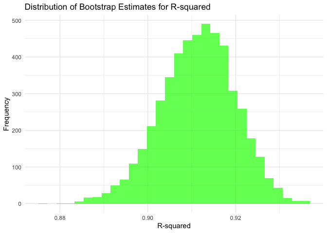

p8105_hw6_zf2352
================
Zhenkun Fang
2024-12-02

# Problem 1

``` r
weather_df = 
  rnoaa::meteo_pull_monitors(
    c("USW00094728"),
    var = c("PRCP", "TMIN", "TMAX"), 
    date_min = "2017-01-01",
    date_max = "2017-12-31") %>%
  mutate(
    name = recode(id, USW00094728 = "CentralPark_NY"),
    tmin = tmin / 10,
    tmax = tmax / 10) %>%
  select(name, id, everything())
```

``` r
boot_sample = function(df) {
  sample_frac(df, replace = TRUE)
}


boot_straps = 
  tibble(strap_number = 1:5000) |> 
  mutate(
    strap_sample = map(strap_number, \(i) boot_sample(df = weather_df))
  )

boot_straps
```

    ## # A tibble: 5,000 × 2
    ##    strap_number strap_sample      
    ##           <int> <list>            
    ##  1            1 <tibble [365 × 6]>
    ##  2            2 <tibble [365 × 6]>
    ##  3            3 <tibble [365 × 6]>
    ##  4            4 <tibble [365 × 6]>
    ##  5            5 <tibble [365 × 6]>
    ##  6            6 <tibble [365 × 6]>
    ##  7            7 <tibble [365 × 6]>
    ##  8            8 <tibble [365 × 6]>
    ##  9            9 <tibble [365 × 6]>
    ## 10           10 <tibble [365 × 6]>
    ## # ℹ 4,990 more rows

``` r
bootstrap_results1 = 
  boot_straps |> 
  mutate(
    models = map(strap_sample, \(df) lm(tmax ~ tmin, data = df) ),
    results = map(models, broom::glance)) |> 
  select(-strap_sample, -models) |> 
  unnest(results) 


bootstrap_results1 |> 
  summarize(
    rsquare_lower = quantile(r.squared, 0.025), 
    rsquare_upper = quantile(r.squared, 0.975)) %>% 
    knitr::kable(digits = 3)
```

| rsquare_lower | rsquare_upper |
|--------------:|--------------:|
|         0.894 |         0.927 |

``` r
bootstrap_results2 = 
  boot_straps |> 
  mutate(
    models = map(strap_sample, \(df) lm(tmax ~ tmin, data = df) ),
    results = map(models, broom::tidy)) |> 
  select(-strap_sample, -models) |> 
  unnest(results) 

bootstrap_results2 = bootstrap_results2 |> 
  group_by(strap_number) |> 
  summarize(log_beta = log(
      estimate[term == "(Intercept)"] * estimate[term == "tmin"]
    )
              )
  
bootstrap_results2 %>% 
  summarize(
    log_beta_lower = quantile(log_beta, 0.025), 
    log_beta_upper = quantile(log_beta, 0.975)
  ) %>% 
    knitr::kable(digits = 3)
```

| log_beta_lower | log_beta_upper |
|---------------:|---------------:|
|          1.965 |          2.059 |

``` r
ggplot(bootstrap_results1, aes(x = r.squared)) +
  geom_histogram(bins = 30, fill = "green", alpha = 0.7) +
  labs(
    title = "Distribution of Bootstrap Estimates for R-squared",
    x = "R-squared",
    y = "Frequency"
  ) +
  theme_minimal()
```

<!-- -->

``` r
ggplot(bootstrap_results2, aes(x = log_beta)) +
  geom_histogram(bins = 30, fill = "blue", alpha = 0.7) +
  labs(
    title = "Distribution of Bootstrap Estimates for log_beta",
    x = "log_beta",
    y = "Frequency"
  ) +
  theme_minimal()
```

<!-- -->
